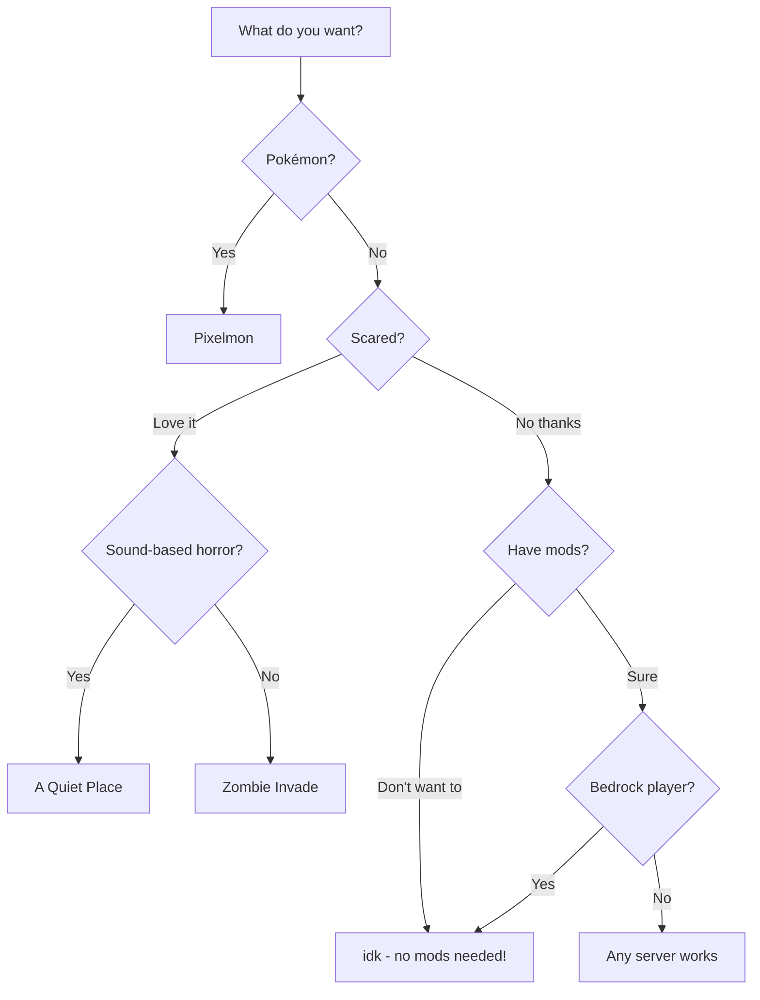

# Our Servers

-   :material-pickaxe:{ .lg .middle } **[idk](idk.md)**

    ---

    Vanilla-enhanced survival. Server-side mods, no client install needed. Works with Bedrock!

    [:octicons-arrow-right-24: Connect now](idk.md)

-   :material-pokeball:{ .lg .middle } **[Pixelmon](pixelmon.md)**

    ---

    Pokémon in Minecraft! Catch, train, battle. 1,000+ Pokémon from all generations.

    [:octicons-arrow-right-24: Gotta catch 'em all](pixelmon.md)

-   :material-ghost:{ .lg .middle } **[A Quiet Place](quiet-place.md)**

    ---

    Horror survival. They hunt by sound. They can hear your microphone. Stay quiet or die.

    [:octicons-arrow-right-24: If you dare](quiet-place.md)

-   :material-skull:{ .lg .middle } **[Zombie Invade](zombie-invade.md)**

    ---

    100-day zombie apocalypse challenge. Massive hordes. Every night is deadlier.

    [:octicons-arrow-right-24: Survive](zombie-invade.md)

---

## Quick Comparison

| Server | Style | Client Mods | Bedrock | Difficulty |
|--------|-------|-------------|---------|------------|
| **idk** | Vanilla+ survival | Optional | :material-check: Yes | Normal |
| **Pixelmon** | Pokémon adventure | Required | :material-close: No | Easy-Medium |
| **A Quiet Place** | Horror survival | Required | :material-close: No | Hard |
| **Zombie Invade** | Apocalypse survival | Required | :material-close: No | Hard |

---

## Which Server Should I Play?

---

## All Servers Run 24/7

Based in Australia (Hobart timezone). All servers auto-backup daily.

Questions? Ask Dad.
